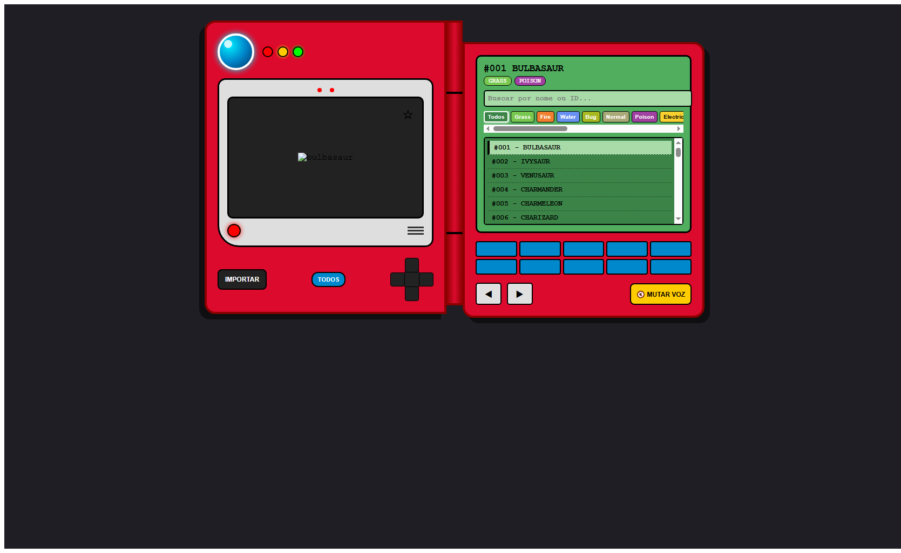

# Pokédex

Aplicação web que recria a experiência de uma Pokédex clássica. A interface permite consultar os 151 Pokémon iniciais, navegar pela lista, buscar por nome ou número, filtrar por tipo e salvar favoritos. O projeto combina uma API REST em Django com uma interface em Vue 3.

## Demonstração

Como a aplicação funciona em uma única tela, as capturas abaixo mostram diferentes estados dos mesmos painéis.

| Visão geral | Busca por nome |
| --- | --- |
|  |  |

| Filtro por tipo | Lista de favoritos |
| --- | --- |
|  |  |

As ilustrações dos Pokémon são carregadas de URLs externas da PokéAPI. Elas podem não aparecer nas capturas feitas em ambientes sem acesso à internet.

## Funcionalidades

- Consulta e navegação pelos 151 Pokémon da primeira geração.
- Busca em tempo real por nome ou número da Pokédex.
- Filtros por tipo e opção para exibir somente os favoritos.
- Seleção e navegação pelos Pokémon filtrados.
- Favoritos salvos no backend.
- Narração do nome e dos tipos em português usando a Web Speech API, com controle para silenciar ou ativar a voz.
- Efeitos sonoros nos controles da interface com a Web Audio API.
- Importação dos dados iniciais pela PokéAPI.

## Tecnologias

| Camada | Tecnologias |
| --- | --- |
| Frontend | Vue 3, Vite, Pinia e Axios |
| Backend | Python, Django e Django REST Framework |
| Banco de dados | SQLite |
| Recursos do navegador | Web Speech API e Web Audio API |
| Dados de Pokémon | [PokéAPI](https://pokeapi.co/) |

## Estrutura do projeto

```text
.
├── docs/
│   └── screenshots/       # Capturas das funcionalidades
└── pokedex/
    ├── backend/
    │   ├── config/        # Configurações e rotas do Django
    │   ├── pokemon/       # Modelo, API e migrações
    │   ├── db.sqlite3     # Banco local de desenvolvimento
    │   └── manage.py
    └── frontend/
        ├── src/
        │   ├── components/ # Painéis da Pokédex
        │   ├── stores/     # Estado, filtros, áudio e API
        │   └── App.vue
        └── package.json
```

## Executar localmente

### Requisitos

- Python 3.10 ou superior.
- Node.js e npm.
- Acesso à internet para importar dados da PokéAPI e carregar as ilustrações remotas.

### Backend

No PowerShell, a partir da raiz do repositório:

```powershell
cd pokedex\backend
python -m venv .venv
.\.venv\Scripts\Activate.ps1
python -m pip install -r requirements.txt
python manage.py migrate
python manage.py runserver
```

A API ficará disponível em `http://127.0.0.1:8000/api/pokemons/`.

### Frontend

Abra outro terminal na raiz do repositório:

```powershell
cd pokedex\frontend
npm install
npm run dev
```

Abra o endereço indicado pelo Vite, normalmente `http://localhost:5173`.

### Importar os dados

Use o botão **IMPORTAR** na interface para carregar os primeiros 151 Pokémon da PokéAPI. A API também oferece o endpoint `POST /api/pokemons/seed/` para essa operação.

## API

| Método | Endpoint | Descrição |
| --- | --- | --- |
| `GET` | `/api/pokemons/` | Lista os Pokémon cadastrados. |
| `GET` | `/api/pokemons/{id}/` | Consulta os dados de um Pokémon. |
| `PATCH` | `/api/pokemons/{id}/` | Atualiza campos do Pokémon, incluindo o favorito. |
| `POST` | `/api/pokemons/seed/` | Importa dados da PokéAPI; aceita `limit` no corpo JSON. |

## Testes do backend

Com o ambiente virtual ativo e o terminal na pasta `pokedex/backend`:

```powershell
python manage.py test
```
